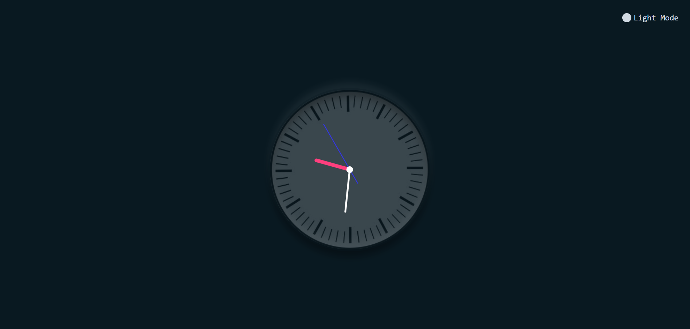
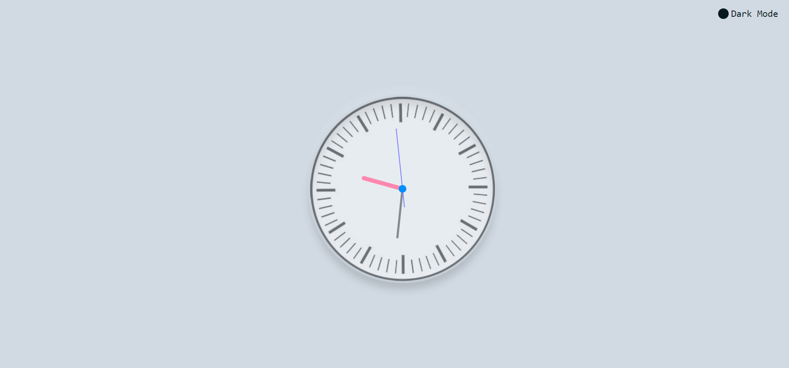

# Analog Clock





Welcome to the Analog Clock project! This is a simple yet elegant analog clock built using HTML, CSS, and JavaScript. The clock displays the current time with a traditional hour, minute, and second hand.

## Table of Contents

- [Features](#features)
- [Demo](#demo)
- [Installation](#installation)
- [Usage](#usage)
- [Contributing](#contributing)

## Features

- Real-time display of the current time
- Smooth and accurate movement of clock hands
- Responsive design for different screen sizes
- Dark & Light mode
- Simple and clean user interface

## Demo

You can try out the clock live [here](https://omgupta7352.github.io/analog_clock/).

## Installation

To run the Analog Clock locally, follow these steps:

1. **Clone the repository:**

    ```sh
    git clone https://github.com/your-username/analog_clock.git
    ```

2. **Navigate to the project directory:**

    ```sh
    cd analog_clock
    ```


## Usage

Once you have the clock open in your browser, it will automatically display the current time with the hour, minute, and second hands moving smoothly.

## Contributing

Contributions are welcome! If you have any ideas or improvements, feel free to open an issue or create a pull request.

1. **Fork the repository**
2. **Create a new branch:** `git checkout -b feature/your-feature-name`
3. **Commit your changes:** `git commit -m 'Add some feature'`
4. **Push to the branch:** `git push origin feature/your-feature-name`
5. **Open a pull request**


